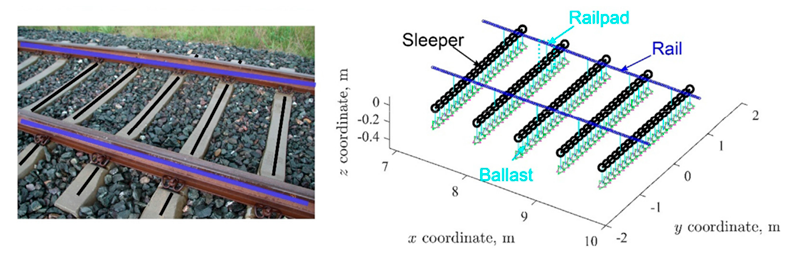

# Algorithmic structural health monitoring of railway infrastructure


### Background
Railway has become an increasingly popular transportation mode all over the world. In the Netherlands, the railway network reaches up to 3223 km in total and transports millions of passengers and million tonnes of freight every year. In recent decades, the Dutch railway keeps evolving to be safer, faster, and greener to become more competitive with air and road transport. The condition of railway tracks affects the safety, ride comfort, and sustainability of train operations. To achieve this goal, the health condition of railway tracks needs to be timely and properly maintained.


**Figure 2** shows a typical modern railway track structure. The rails are fixed on the sleepers by fasteners (consisting of rail pads and clamps). Rail pads are made of resilient material. The ballast layer also provides elasticity for the track structure. The stiffness of these two components determines the overall track stiffness. In practice, track stiffness can be measured by a non-destructive hammer test, as shown in **Figure 2**. The rail head is excited with a hammer, and the dynamic response (usually acceleration) is measured at the location of interest. Then, the input force and output accelerations are used to calculate a frequency response function (FRF), from which the track stiffness can be identified. The main components of this structure are,

1. *Rail* are the members of the track laid in two parallel lines to provide an unchanging, continuous, and level surface for the movement of trains. They are made of high-carbon steel. Rails provide a pathway which is smooth and has very little friction and act as a lateral guide for the wheels. They bear the stresses developed due to vertical loads transmitted to them by the axles and wheels of rolling stock as well as due to braking and thermal forces. They transmit the load to a large area of the formation through sleepers and the ballast.

2. *Sleepers* are the transverse ties that are laid to support the rails. They transmit the wheel load from the rails to the ballast, acting as an elastic medium. They hold the rails in their correct gauge and alignment.

3. *Rail pads* are elastic material typically made of rubber provided between the rails and the sleepers to absorb shocks, dampen vibration, provide electric isolation and prevent the abrasion of the bottom surface of the rail against the sleeper. 

4. *Ballast* is a layer of granular material placed and packed below and around sleepers for distributing load from the sleepers to the formation. It provides drainage, longitudinal and lateral stability to the track. It provides a level and hard bed for the sleepers to rest on and transfers and distributes load from the sleepers to a large area of the underlying soil. It also provides elasticity and resilience to the track for proper riding comfort. 

5. *Stratified Material* or Formation is the prepared flat surface, which is ready to receive the ballast, along with sleepers and rails. The formation supports the entire track structure. It bears the load transmitted to it from the ballast. And facilitates drainage while providing overall stability to the track. 

| |
|----------------------------------------|
|**Figure 1 & 2:** Typical arrangement of a railway track & a hammer test on a railway track. | 


### Details

<p style="text-align:justify; width:60%;">
This study makes use of a 3D finite element model, as shown in <b>Figure 3</b>. The total length of the track model is 12 m with 20 sleeper spans. The rail and sleepers are meshed with Timoshenko beam elements. The fasteners are modelled using the Kelvin-Voigt (KV) model with an elastic spring and viscous damper connected in parallel. The ballast layer is modelled as discretely distributed KV models under each sleeper node. The elastic spring elements in KV models are derived from the stiffness property of fasteners and ballast layer. Accordingly, the viscous dampers represent the damping effects of the fasteners and ballast layer.
</p>

<blockquote style="width: 60%;">

**Project Objective:** To firstly perform an investigation into the response and behaviour of multiple railway samples and determine if we can remotely monitor the structural condition of railway infrastructure through its response to excitation. And in the second place, to develop an algorithmic approach to determine the condition of railway infrastructure at different locations.

</blockquote>

| |
|----------------------------------------|
|**Figure 3:** Mechanical scheme of the Finite element model. | 


## Breakdown of the Bayesian Optimization analysis

The solution method employed in the Bayesian optimizer involves several key steps and tackling several key issues such as how to be able to manage constraints not related to our input vector and many user-defined choices and values such as building a loss function robust enough which allows the gaussian process to learn the solution space. How these issues where tackled is explained in the following steps. 

### 1. Algorithm Initiation

We initiate a random search in the solution space by taking n random samples from the solution space. To do so we first constrain our solution space by defining our **bounds** to exploration locations which may produce sensical values and hence not throw off the algorithm excessively when searching. And then compute the losses at these n random locations. A condensed version of the loss function is as follows,

```python
    def loss_function(self, x_list):
        
        A_list, y_list = self.areas_coordinates_write_split(x_list)
        mass_truss = self.mass_truss(A_list, y_list)
        frequencies = self.eigenfrequencies(A_list)

        freq_penalty = 0
        all_positive = True
        for f, t in zip(frequencies, self.config["freq_constraints"]):
            diff = f - t
            penalty_factor = 1 if diff >= 0 else self.config["violation_penalty"]
            freq_penalty += penalty_factor * (np.abs(diff) / t)
            if diff < 0:
                all_positive = False
        
        if all_positive:  
            self.state["mass_norm"] = min(mass_truss, self.state["mass_norm"])

        normalized_mass_penalty = (mass_truss - self.state["mass_norm"]) / self.state["mass_norm"]
        normalized_freq_penalty = freq_penalty / len(self.config["freq_constraints"])
        constraint_violation = normalized_freq_penalty + normalized_mass_penalty

        LOSS = (self.config["mass_weight"] * normalized_mass_penalty +
                self.config["freq_weight"] * normalized_freq_penalty)
        
        # -------------------------- Optimisation monitoring ------------------------- #
        print(f'{tabulate(optmonitor_data, headers="firstrow", tablefmt="grid")}\n')
        self.state["monitor_df"] = pd.concat([self.state["monitor_df"], new_data], ignore_index=True)
         
        return LOSS
```
As we can see we compute the **mass** and **first three eigenfrequencies** of the truss. We then calculate a normalised frequency penalty by dividing the difference between the frequencies with its constraints and applying a penalty factor in case that the difference is smaller than zero. Through this method we are able  to penalise solutions that do not meet the constraints but we also don't excessively penalise potentially close solutions to the minima abd throw off the gaussian process. 

Then in the case that the constraints have been met we take the current minimum mass and calculate the difference between the current mass and the lowest obtained mass and normalise it by dividing the difference by minimum mass. This approach allows for the mass penalty to always update as better solutions are obtained. 

The loss is finally computed by multiplying the the normalised **mass** and **frequency** components by user-specified **weight factors**. 

We then **normalise** our data through `MinMaxscaler` for the contributions of the coordinates and and areas to be of equal weight despite unequal magnitudes. We then initiate the other hyperparameters of the `TRUSS` object, this includes the loss function components such as the violation factor and corresponding weights of the mass and frequency components of the loss function which if well formulated should evaluate the proximity to a optimal solution.

The following shows the initiation of the random search,
```python
for _ in range(n_samples):
    x_c = np.copy(x_0) # Reset seed
    x_random = TRUSS1.Initial_guess(optim_dims)
    x_c[optim_dims] = x_random
    x_list.append(x_c)
 
trap = io.StringIO()
with redirect_stdout(trap):
    for x in x_list:
        LOSS = TRUSS1.loss_function(x)
        y_list.append(LOSS)
```

### 2. Gaussian process characteristics & fitting

We then fit the initiated n-vectors with the calculated n targets to a single task Gaussian process `SingleTaskGP` through the `set_train_data` function. This Gaussian process makes use by default use of a Matern kernel although this can be changed through the `covar_module` since the use of Matern kernel is of interest to us this was left unchanged. The Matern kernel can be expressed in the following way,

$$
k(\mathbf{x}, \mathbf{x'}) = \frac{\sigma_{f}^2}{\Gamma(\nu)2^{\nu-1}} \left(1 + \frac{\left\| \sqrt{2\nu}d/\ell \right\|^2}{\nu}\right)^{-\nu}K_{\nu}\left(\sqrt{2\nu}d/\ell\right)
$$ 

Additionally, we then set the `SingleTaskGP` loss evaluation through the `ExactMarginalLogLikelihood`, 

$$
\mathcal{L} = p_f(\mathbf{y} | \mathbf{X}) = \int p \left( \mathbf{y} | f(\mathbf{X}) \right) \cdot p(f(\mathbf{X}) | \mathbf{X}) \, df \quad \text{(3)}
$$

>**NOTE**: The decision to use a single task gp was a decision to simplify the problem through accounting the different components of the loss function through additional hyperparameters (i.e the NF and mass component weights of the loss function) nevertheless, it could be interesting to explore the use multi-task GP's.

### 3. The algorithm process 

We now initiate the optimiser algorithm, this is done by iteratively try to minimise the loss through gradient based methods `optimize_acqf` which is guided by our acquisition function, in this case the `Expectedimprovement` function which can be expressed as follows,

$$
\text{EI}(x) = \mathbb{E}\bigl[
\max(y - f^*, 0) \mid y\sim \mathcal{N}(\mu(x), \sigma^2(x))
\bigr]
$$

The EI function is a simple yet effective way to guide the minimiser since we will always optimise the region where we believe the potential gain is highest. To do so we sample from our gaussian process and compare it with out current best solution $f^{*}$ we then perform $\text{argmin}(\text{EI}(x))$ for the n first solutions `raw_samples` which are then ran through the minimiser.

In addition to this, the optimiser is set with some predisposed bounds where we can ensure as an example that our 15 cross section do not yield negative values leading to complex eigenfrequencies. We also set a number of `num_restarts` to help the minimiser to reset in case it gets stuck in local minima. Then the targets are unnormalised to be evaluated by the loss function and then with the results we update the posterior and refit the gaussian process through `set_train_data`. The above process is all contained in the following code excerpt through use of the `BoTorch` module, our own Bayesian optimiser can also be found in [TRUSS_BOPT.py](TRUSS1/truss_bridge/TRUSS_Bopt.py),

```python
def SingleBOPT(Y_init_single, X_init_single, n_iter, batch_size, Nrestats, objective_function):
    gp_model = SingleTaskGP(X_init_single, Y_init_single)
    mll = ExactMarginalLogLikelihood(gp_model.likelihood, gp_model)
    fit_gpytorch_model(mll)
    gp_model.set_train_data(inputs=X_init_single, targets=Y_init_single.flatten(), strict=False)
    
    for iteration in range(n_iter):
        print(f'Iteration: {iteration} Best loss = {Y_init_single.min().item():.2f}\n')
        acq_func = ExpectedImprovement(model=gp_model, best_f=Y_init_single.min(), maximize=False)
        new_x, _ = optimize_acqf(
            acq_function=acq_func,
            bounds=bounds,
            q=1,
            num_restarts= Nrestats,
            raw_samples= batch_size,
        )
        new_x_unnorm = unnormalize(new_x, bounds=bounds)
        new_y = objective_function(new_x_unnorm)
        new_y = torch.tensor(new_y, dtype=torch.float32).reshape(1,-1)
        X_init_single = torch.cat([X_init_single, new_x])
        Y_init_single = torch.cat([Y_init_single, new_y])
        
        gp_model.set_train_data(inputs=X_init_single, targets=Y_init_single.flatten(), strict=False)
        fit_gpytorch_model(mll)
    return X_init_single, Y_init_single
```
And thats it! Thats how easy a procedure is necessary to perform efficient informed optimisation with non implementable constraints. The above process is also described in the following figure,


**Figure 5:** A description of the solution method through the optimiser and its different components. 

## Results

The following discussion will evaluate the success of the project through benchmarking the TRUSS approach against [Kanarachos et al., 2017](https://dx.doi.org/10.1016/j.compstruc.2016.11.005) standard optimisation algorithm, this will be followed by an investigation into the TRUSS solution behaviour.

### 1. Benchmarking against Kanarachos et al., 2017

As can be seen Kanarachos et al., 2017 and TRUSS produce very similar results, Kanarachos outperforms TRUSS achieving a lower mass whilst TRUSS optimises more for the Natural frequencies. One can also observe how TRUSS is computationally more efficient than Kanarachos converging much faster to a solution even as will be seen later plateauing as it converges to the global minima. Kanarachos did not provide a number of iterations with which its algorithm converge but it is expected TRUSS solution to be significantly lower although per iteration it is likely TRUSS has a longer iteration time. The main benchmarks measure against the publication are the following, 

|                   | Cross Section Average [m^2] | Natural Frequency Average [rad/s] | Mass [kg] | Convergence time [s] |
|-------------------|-----------------------------|-----------------------------------|-----------|----------------------|
| Kanarachos model | 0.000424                    | 41.572427                         | 360.077107| 473                  |
| TRUSS model       | 0.000433                    | 40.809468                         | 364.825316| 315                  |

The first three modal shapes of both trusses are the following,

|                   | Modal shape 1  | Modal shape 2 | Modal shape 3 |
|-------------------|----------------|----------------|----------------|
| Kanarachos model |  |  |  |
| TRUSS model       |  |  |  |

We can observe how both solutions for the first 3 modal shapes are similar, yet in comparison to each other they exhibit anti-symmetric dynamic behaviour

### 2. The TRUSS algorithm and its convergence

The algorithm seems to find a global minimum is quite fast fashion, after finding this minimum it then tends to plateau and begin a random walk where it ocassionally believes to find a better solution although this is not the case. The below figure showing an optimisation run illustrates how the loss function although suitable can still be improved, since the lowest loss does not correspond to the lowest mass solution that meets the constraints. Moreover, the solution in multiple runs has always been found at the bottom of the first descending branch therefore it might be in best interest to implement a form or early stopping to achieve even faster convergence times. In any case the best solution is still strong and robust.


**Figure 6:** Optimisation run with the different solutions per time step. 

A convergence study of the algorithm with loose hyperparameter tuning was performed with 5 runs, where the mean and  95th percentile confidence criterion where computed.As we can observe the variance between runs is small for exception of run 1 which gave a very erratic behaviour which had a strong influence o the standard deviation. Despite this we can observe most importantly that despite different initiation parameters the convergence shape is similar for most runs which makes reference to a robust convergence, although this claim should be investigated further and does not account for the previous hyperparameter tuning.

The solution to the yielded the following graph,


**Figure 7:** TRUSS convergence study. 

 

## Repo structure and contents
- 口Reading includes the original paper and reference, investigation and reference results obtained with other optimization approaches, check this paper: [Kanarachos et al., 2017](https://dx.doi.org/10.1016/j.compstruc.2016.11.005)
- **pyJive**: a finite element code that can compute the natural frequencies of a given truss design, which can be treated as black box model for this project
- **truss_bridge**: a directory with input files for the case of the project, including a [notebook](truss_bridge/truss_bridge.ipynb) with a demonstration of how to interact with the finite element code
- **Truss notebook**: The Jupyter notebook containing the implementation of the Bayesian optimiser and the posterior analysis. It covers a from blank implementation, a solution through Botorch module and a posterior analysis on the behaviour of the algorithm against [Kanarachos et al., 2017](https://dx.doi.org/10.1016/j.compstruc.2016.11.005) and its convergence behaviour. 
- **End of project presentation**: A breakdown of the project and some of its detail can be found in [TrussBOPT.pptx](TRUSS1/TRUSS1/TrussBOPT_EOP.pptx).

### Useful links
The original publication:
- Approach undertaken by Kanarachos through a pure optimisation approach, check this paper for the publication: [https://dx.doi.org/10.1016/j.compstruc.2016.11.005](https://dx.doi.org/10.1016/j.compstruc.2016.11.005)

Tutorials on Bayesian optimization:
- [https://towardsdatascience.com/bayesian-optimization-a-step-by-step-approach-a1cb678dd2ec](https://towardsdatascience.com/bayesian-optimization-a-step-by-step-approach-a1cb678dd2ec)
- [https://www.ritchievink.com/blog/2019/08/25/algorithm-breakdown-bayesian-optimization](https://www.ritchievink.com/blog/2019/08/25/algorithm-breakdown-bayesian-optimization)